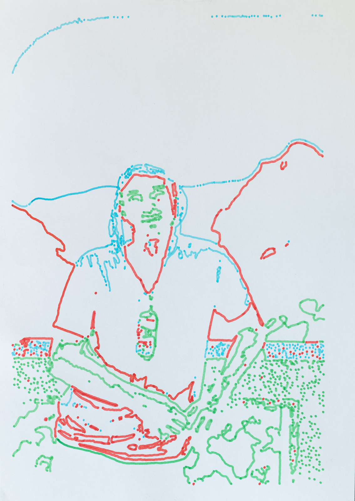

# OmniRevolve

XY plotter (4 colors) · STM32F446 + ESP32 (microROS) · ROS 2 UI

- GitHub org: https://github.com/omnirevolve
- Umbrella repo: https://github.com/omnirevolve/omnirevolve

```mermaid
flowchart LR
UI -- byte_stream/cmds --> ESP32
ESP32 -- SPI DMA:512B --> STM32
STM32 -- telemetry via UART --> ESP32 --> UI


## Photos

<figure align="center">
  
  <figcaption>OmniRevolve plotter — 4-color carousel (mechanically scalable to ~15 colors)</figcaption>
</figure>

<p align="center">
  <figure style="display:inline-block; width:49%; min-width:320px; text-align:center;">
    
    <figcaption>Sample output #1</figcaption>
  </figure>
  <figure style="display:inline-block; width:49%; min-width:320px; text-align:center;">
    
    <figcaption>Sample output #2</figcaption>
  </figure>
</p>


## Videos

<p align="center">
  <a href="https://www.youtube.com/watch?v=epHM4n3US48">
    
  </a>
  <a href="https://www.youtube.com/watch?v=NMgnAYHxDm4">
    
  </a>
  <a href="https://www.youtube.com/watch?v=BMJWWeqkJn0">
    
  </a>
</p>

